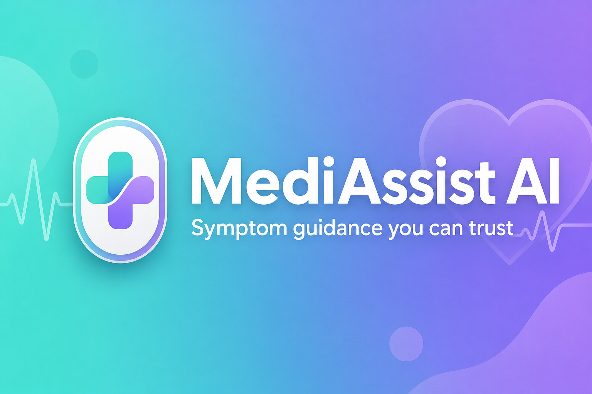
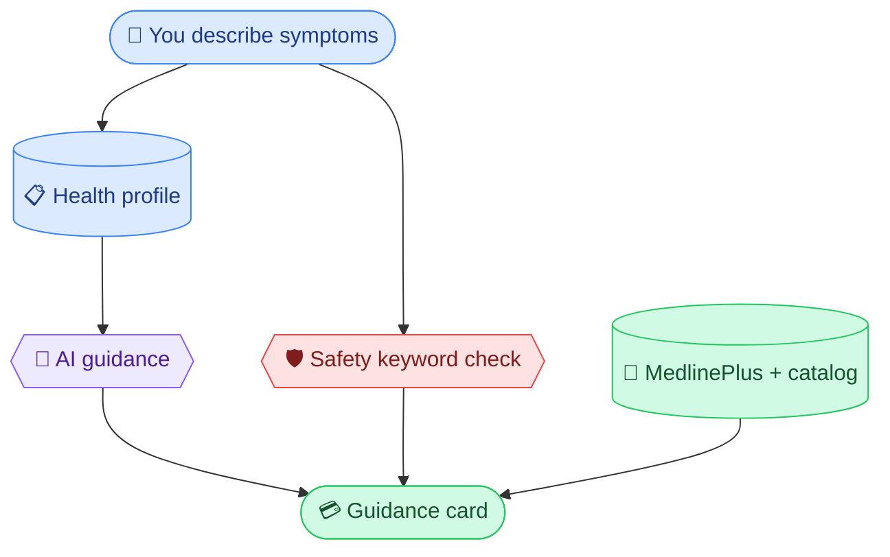

<p align="center">
  
</p>

<p align="center">
  <strong>Describe how you feel. Get clear, educational guidance — not a diagnosis.</strong>
</p>

<p align="center">
  <a href="#-try-it-in-2-minutes"></a>
  <a href="#-what-you-see"></a>
  <a href="#-for-developers"></a>
  <a href="DEPLOY.md"></a>
</p>

<p align="center">
  
  
  
  
  
  
</p>

---

### 🚨 Before you read anything else

<table>
<tr>
<td width="48">

🆘

</td>
<td>

**Emergency?** If you or someone else might be in immediate danger, **call your local emergency number now** (911 · 999 · 112). MediAssist cannot send help or monitor you in real time.

</td>
</tr>
</table>

---

## ✨ At a glance

<table>
<tr>
<th>💬 You get</th>
<th>🌐 You need</th>
<th>🚫 We never</th>
<th>🛠 Built with</th>
</tr>
<tr>
<td>A chat + a colorful <strong>guidance card</strong> (urgency, steps, red flags, trusted links)</td>
<td>Any modern browser — <strong>no account required</strong> to try</td>
<td>Diagnose, prescribe, or dispatch EMS</td>
<td>Next.js · FastAPI · OpenAI · optional GCS</td>
</tr>
</table>

MediAssist AI is a **symptom chat** that helps you think through how urgent things might be, what to consider next, and where to read more (including **NIH MedlinePlus**) — for **learning and planning**, not replacing your clinician.

---

## 🚀 Try it in 2 minutes

```
  ① Open app          ② Health profile       ③ Describe symptoms
       │                      │                        │
       ▼                      ▼                        ▼
   Welcome screen      Age · allergies ·        "Headache 2 days,
                       conditions · meds         worse in morning"
                                                       │
                                                       ▼
                                              ④ Read guidance card
                                                 (urgency + steps + links)
```

| Step | Do this |
|:---:|:---|
| **1** | Open the app — skim the welcome message |
| **2** | Fill **Health profile** (sidebar or Account) |
| **3** | Type symptoms naturally — duration, severity, triggers |
| **4** | Read the **guidance card** under the reply |
| **5** | **Sign up** only if you want cloud sync — guests work fine |

<details>
<summary><strong>⌨️ Quick tips</strong></summary>

- **Enter** → send · **Shift+Enter** → new line  
- **New chat** in the sidebar for a fresh topic  
- **Light / dark** toggle in the header  
- On mobile, open history from the **menu** icon  

</details>

---

## 🎨 What you see

Every reply ships a **guidance card** — structured, scannable, color-coded. Not a wall of AI text.

### Urgency levels (color-coded in the app)

<table>
<tr>
<td align="center"><strong>🟢 Self-care</strong><br/><sub>Manage at home</sub></td>
<td align="center"><strong>🟣 See a doctor soon</strong><br/><sub>Clinic in a few days</sub></td>
<td align="center"><strong>🔵 Urgent care</strong><br/><sub>Same-day visit</sub></td>
<td align="center"><strong>🔴 Emergency</strong><br/><sub>Call emergency services</sub></td>
</tr>
<tr>
<td colspan="4" align="center"><sub>Emergency level shows a sticky banner with 911 · 999 · 112 reminders</sub></td>
</tr>
</table>

| Piece | What it gives you |
|:---:|:---|
| 📋 **Summary** | Plain English, tuned to your profile |
| ✅ **Care steps** | Practical ideas — never prescriptions or doses |
| 📚 **Education** | Context so the “why” makes sense |
| ⚠️ **Red flags** | “Stop and get help” warning signs |
| 🔗 **References** | MedlinePlus + our **120-condition** learning catalog |
| 🔊 **Read aloud** | Optional TTS in supported browsers |

---

## 🧠 How MediAssist thinks



| Layer | Role |
|:---:|:---|
| 👤 **Your profile** | Age, pregnancy, conditions, allergies, meds — sent every time so you don’t repeat yourself |
| 🤖 **The AI** | No diagnosis · no prescriptions · plain language · flags true emergencies |
| 🛡️ **Safety rules** | Extra scan of *your* words — can **raise** urgency, never lower it |
| 📖 **Sources** | Links on the card so you can verify, not just trust a paragraph |

### Guest vs signed in

| | 👋 Guest | 🔐 Signed in |
|:---:|:---:|:---:|
| Chat & triage | ✅ | ✅ |
| Profile & history | 💾 This device | ☁️ Your cloud bucket |
| After login | — | Guest data can **merge** in |

---

## 💎 Why people like MediAssist

<table>
<tr>
<td width="50%" valign="top">

**🎯 Profile-first**  
Context travels with you — not lost in chat memory.

**🛡️ Defense in depth**  
Model + keyword safety when wording sounds serious.

**🔍 Show your work**  
References on every card, not a black box.

</td>
<td width="50%" valign="top">

**☁️ Your bucket**  
Optional GCS — *your* JSON, not a locked vendor DB.

**🔒 Keys on server**  
OpenAI never runs in the browser.

**🚪 No gatekeeping**  
Full triage as a guest; account when *you* want sync.

</td>
</tr>
</table>

---

## ⛔ What we are *not*

<table>
<tr>
<td>❌</td><td>Medical <strong>diagnosis</strong></td>
<td>❌</td><td><strong>Prescriptions</strong> or dosing</td>
</tr>
<tr>
<td>❌</td><td><strong>EMS dispatch</strong> or live monitoring</td>
<td>❌</td><td>A replacement for your <strong>clinician</strong> or nurse line</td>
</tr>
</table>

Use MediAssist to **learn and plan**. Use professionals and emergency services when it truly matters.

---

## 👩‍💻 For developers

<p align="center">
  
</p>

### Run locally (copy-paste)

```bash
npm run install:all
cp backend/.env.example backend/.env
```

`backend/.env` — minimum for triage **without** accounts:

```env
OPENAI_API_KEY=sk-your-key-here
AUTH_SECRET=any-long-random-string-for-local-dev
STORAGE_ENABLED=false
```

`frontend/.env.local`:

```env
NEXT_PUBLIC_API_URL=http://localhost:4000
```

```bash
npm run dev:backend    # → http://localhost:4000
npm run dev:frontend   # → http://localhost:3000
```

### Stack at a glance

| Layer | Tech |
|:---:|:---|
| 🖥 Frontend | Next.js 16 · React 19 · Tailwind 4 · shadcn/ui |
| ⚡ API | FastAPI · Python 3.11+ |
| 🧠 AI | OpenAI (`gpt-4o-mini` default) — **API only** |
| 📦 Storage | Google Cloud Storage (optional) |
| 🌍 Deploy | [DEPLOY.md](DEPLOY.md) — Vercel + Railway |

**Scripts:** `install:all` · `dev:backend` · `dev:frontend` · `test:backend`

<details>
<summary><strong>☁️ Enable GCS (accounts + sync)</strong></summary>

1. Create `gs://mediassist-your-name`  
2. Service account → **Storage Object Admin**  
3. `STORAGE_ENABLED=true`, `GCS_BUCKET=...`, credentials via file or `GCS_CREDENTIALS_JSON`  
4. Restart API — disease catalog auto-seeds  

See **[backend/.env.example](backend/.env.example)** and **[DEPLOY.md](DEPLOY.md)**.

</details>

<details>
<summary><strong>🔌 API cheat sheet</strong></summary>

| What | Endpoint |
|:---|:---|
| Health | `GET /api/health` |
| Triage | `POST /api/health/decision` |
| Stream | `POST /api/health/decision/stream` |
| Auth | `POST /api/auth/signup` · `login` |
| Profile | `GET/PATCH /api/auth/me` · `profile` |
| Chats | `GET/PUT/DELETE /api/chats` |
| Diseases | `GET /api/diseases?search=...` |

Schemas: `backend/app/schemas/`

</details>

<details>
<summary><strong>🔧 Something broken?</strong></summary>

| Symptom | Try |
|:---|:---|
| Generic fallback answer | Valid `OPENAI_API_KEY` + billing |
| `503` storage | Fix GCS or `STORAGE_ENABLED=false` |
| Works local, fails deployed | `NEXT_PUBLIC_API_URL` → public API URL |
| Slow first hit on Railway | Cold start after idle — retry once |

More → **[DEPLOY.md](DEPLOY.md)** troubleshooting

</details>

### Tests

```bash
npm run test:backend
```

Mocks OpenAI · no GCS charges.

---

## 📜 Disclaimer

<p align="center">
  
</p>

MediAssist AI is for **educational purposes only**. It does not provide medical diagnosis, prescriptions, or emergency services. Always talk to qualified healthcare professionals about medical decisions.

<p align="center"><strong>If you think you are having a medical emergency, call your local emergency number immediately.</strong></p>

<p align="center">
  <sub>Made with care for learning — not for replacing yours.</sub>
</p>
